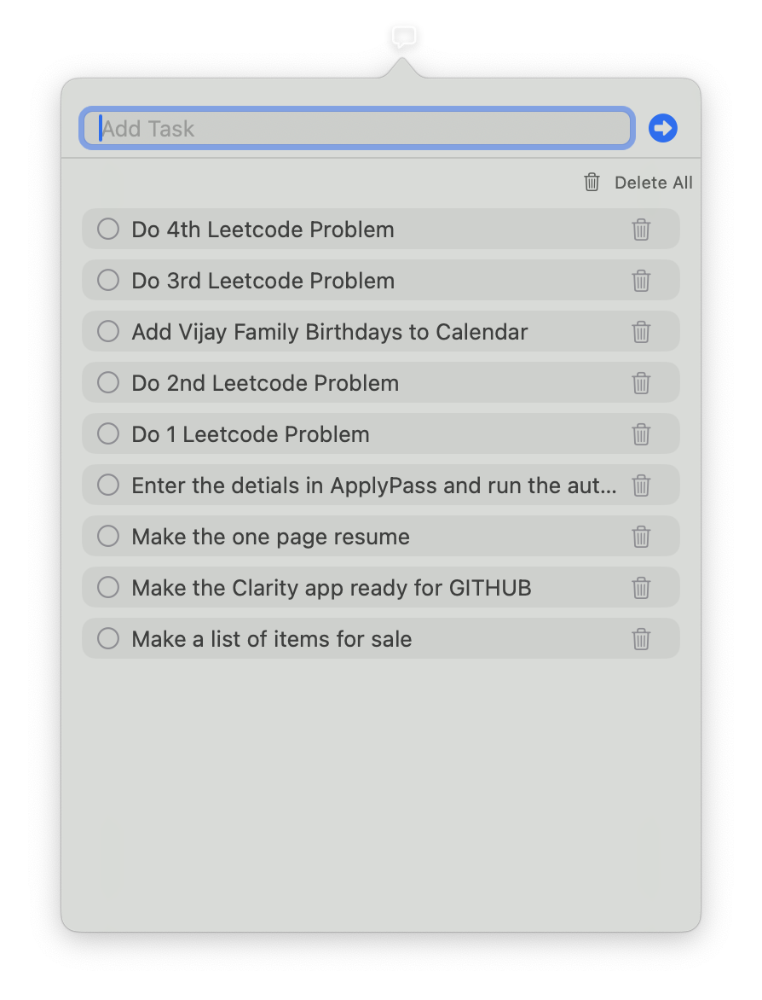
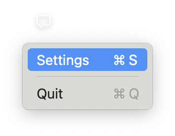
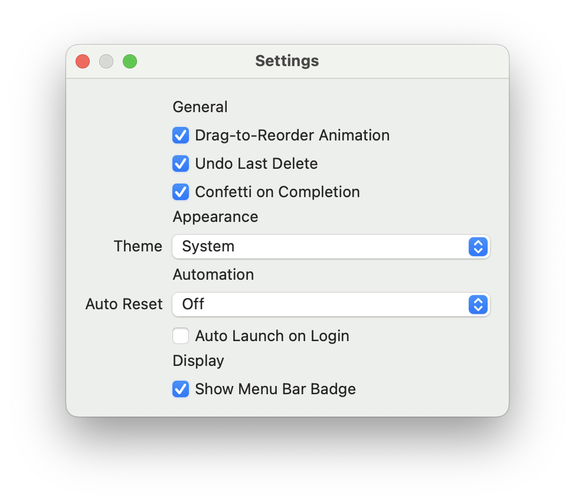

# 📌 Clarity — macOS Menu Bar Task App

Clarity is a sleek and minimalistic macOS menu bar application that helps you track tasks efficiently throughout your day. It's designed to live in your menu bar with quick access, powerful animations, and customizable behaviors to suit your productivity flow.

---

## 🚀 Features

- ✅ **Add Tasks Quickly**: Just type and hit Enter or click the plus button — animated feedback confirms your action.
- 📋 **Check & Delete Tasks**: Mark tasks as complete or remove them with animated transitions.
- 🔁 **Carry Forward Unchecked Tasks**: Automatically move unfinished tasks to the next day based on your settings.
- 🎉 **Confetti on Completion**: All tasks done? Celebrate with a confetti burst!
- 🔁 **Undo Last Delete**: Mistakenly deleted something? You have 5 seconds to undo.
- 🧹 **Auto Reset Options**: Daily/weekly task cleanup based on user preference.
- 🧲 **Drag-to-Reorder**: Reorder tasks via drag-and-drop (with optional animation).
- ⚙️ **Settings Panel**: Configure behaviors like auto-launch, badge icon, reset interval, dark/light theme, etc.
- 🖱️ **Right Click Menu**: Access settings or quit directly from the menu bar.
- 💻 **No Visible Dock or App Switcher**: Designed to stay in your menu bar, not in your way.
---

## 📸 Screenshots

| Feature | Screenshot |
|--------|-------------|
| 🧭 **Task Input & List View** |  |
| 🖱️ **Right-Click Menu** |  |
| ⚙️ **Settings Panel** |  |

---

## 🛠️ How to Run the Project

### Prerequisites

- macOS 13+ (Ventura or later recommended)
- Xcode 15+ installed
- SwiftData & SwiftUI support (already bundled with modern macOS SDKs)

### Setup Instructions

1. **Clone the repository**:
   ```bash
   git clone https://github.com/your-username/Clarity.git
   cd Clarity
   ```

2. **Open the project** in Xcode:
   ```bash
   open TaskMenuBarApp.xcodeproj
   ```

3. **Build and run**:
   - Select `My Mac` as the target device.
   - Press `Cmd + R` to build and run.

4. ✅ The Clarity icon will appear in your **menu bar**.
   - **Left click** to open the task popup.
   - **Right click** to access **Settings** or **Quit**.

---

## 📦 Packaging as a `.dmg`

To distribute this app as a `.dmg`:

1. Archive the app via **Xcode → Product → Archive**.
2. Export as a macOS app and sign it with your Apple Developer ID.
3. Use a tool like [`create-dmg`](https://github.com/create-dmg/create-dmg) or **Disk Utility** to generate a `.dmg`.

---
## 🪪 License

This project is licensed under the [MIT License](LICENSE).
---

## 🙌 Acknowledgements

- Built using SwiftUI & SwiftData
- Icon designed by [your name or tool used]
- Inspired by simplicity and elegance

---

## 💡 Want to Contribute?

Fork the repo, make your changes, and open a pull request! Bug fixes, new features, and design tweaks welcome. Let's make task management fun again.
